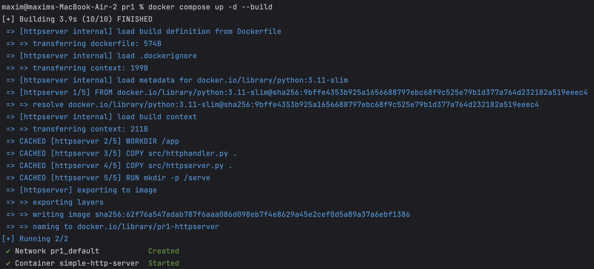
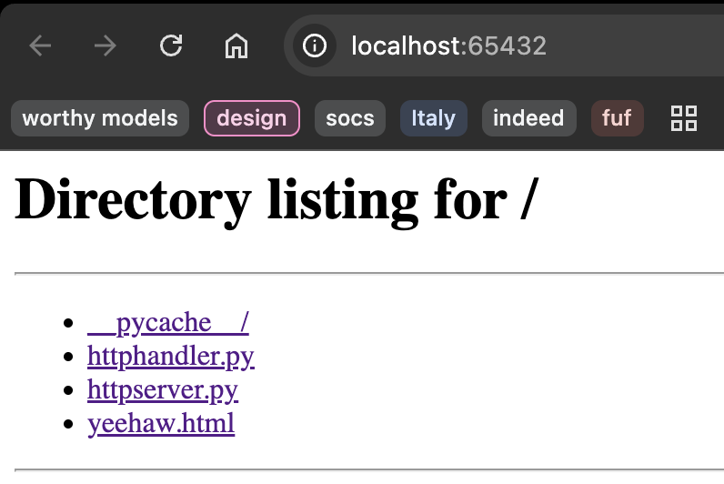
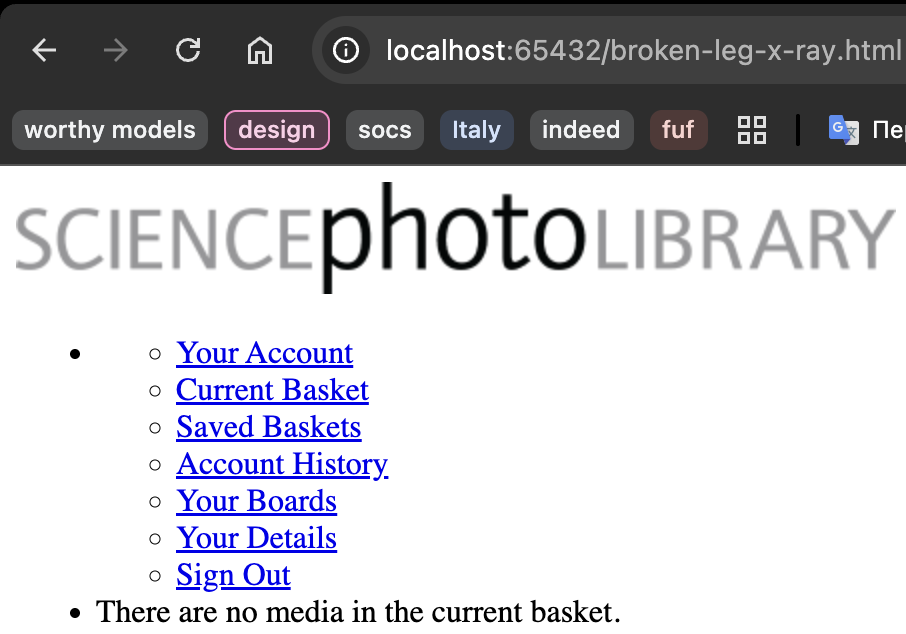
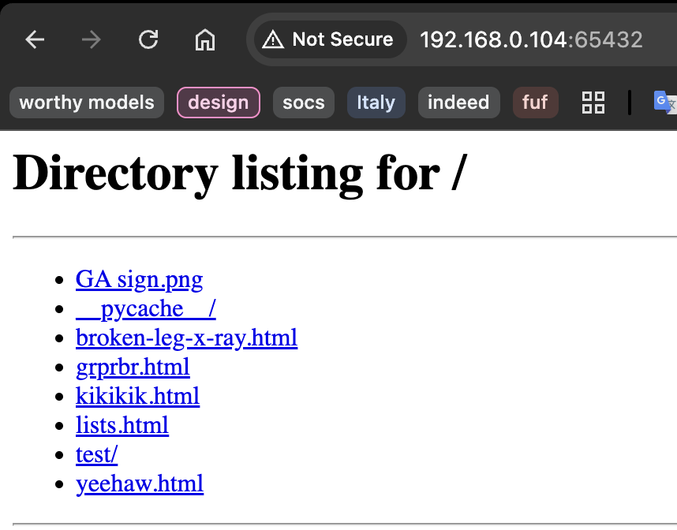
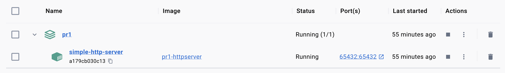
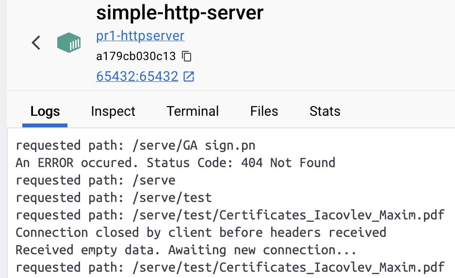
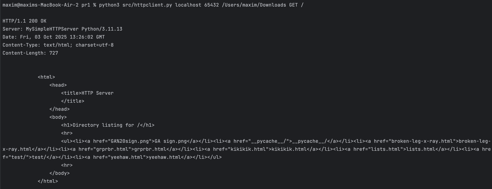
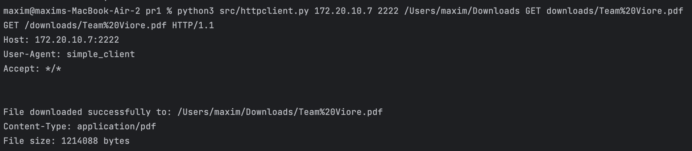

# Lab 1: HTTP file server with TCP sockets

## Task
To develop an HTTP web server that serves HTML files from a directory. 
It will handle one HTTP request at a time. The server program should take the directory  to be served as a command-line argument.
Your web server should accept and parse the HTTP request, read the requested HTML file from the directory, create an HTTP response message consisting of the requested file preceded by header lines, and then send the response directly to the client. If the requested file is not present in the server (or is not an HTML file), the server should send an HTTP “404 Not Found” message back to the client.

### Implementation Showcase
The server runs on port 65432 and serves files from a designated directory. When started, it displays the serving directory and begins accepting connections.

Also works on local network and can be accessed by other network devices.

The screenshot demonstrates the server in action, showing a directory listing with proper HTML formatting. Users can navigate through directories by clicking folder names, and download files by clicking their names. The interface is clean and functional, with proper styling for readability.

When a client requests a file, the server determines the MIME type using the `mimetypes` module and sends the file with appropriate headers. For large files, chunked transfer encoding ensures efficient delivery without excessive memory usage. For directory requests, the server generates an HTML listing with escaped filenames, preventing security vulnerabilities while maintaining usability.

Error handling is comprehensive. If a requested path doesn't exist, the server responds with a 404 Not Found error. If a path traversal attempt is detected, a 403 Forbidden error is returned. For invalid requests or internal errors, appropriate 400 and 500 status codes are sent. Each error response includes a simple HTML page explaining the issue, improving user experience while maintaining security.

The server logs each request to the console, displaying the client address, HTTP method, requested path, and response status code. This logging facilitates debugging and monitoring, allowing administrators to track server activity and identify potential issues or attacks.

## Conclusion
This HTTP server implementation demonstrates fundamental networking concepts and HTTP protocol mechanics while maintaining security and efficiency. By building the server from scratch using socket programming, the project provides deep insight into how web servers operate at the protocol level.

The implementation successfully addresses all specified requirements. Request buffering ensures complete data reception before processing, preventing issues with fragmented requests. Directory traversal prevention through multi-layered path validation protects the filesystem from unauthorized access. HTML escaping in directory listings prevents XSS attacks, maintaining security for end users. Chunked transfer encoding enables efficient delivery of large files without excessive memory consumption.

The modular design separates concerns effectively, with socket management isolated from HTTP protocol logic. This separation enhances maintainability and allows for future extensions, such as supporting additional HTTP methods, implementing caching, or adding authentication mechanisms. The use of Python's standard library keeps the implementation lightweight and dependency-free while leveraging well-tested, reliable functionality.

This project serves as a solid foundation for understanding web server architecture and can be extended with features like concurrent connection handling using threading or asyncio, support for HTTPS through SSL/TLS, implementation of HTTP/2 protocol features, or integration with application frameworks for dynamic content generation. The core principles demonstrated here—protocol compliance, security awareness, and efficient resource management—remain applicable across all these potential enhancements.