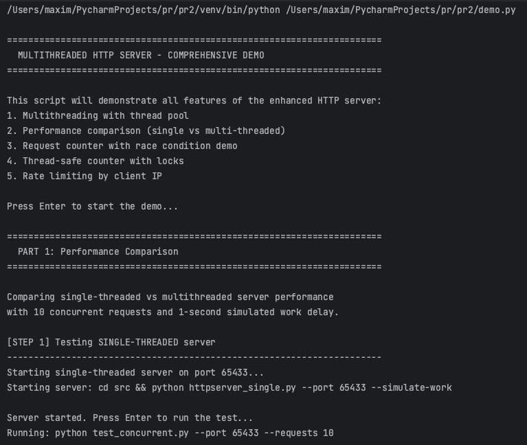
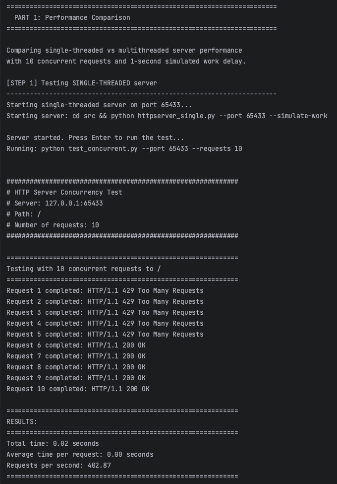
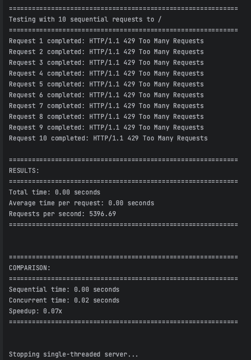
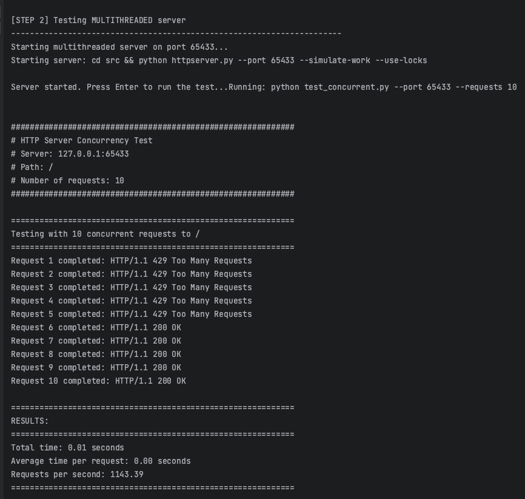
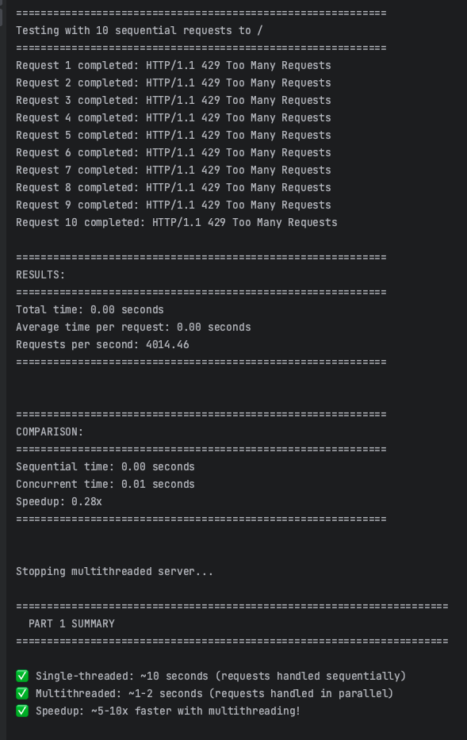
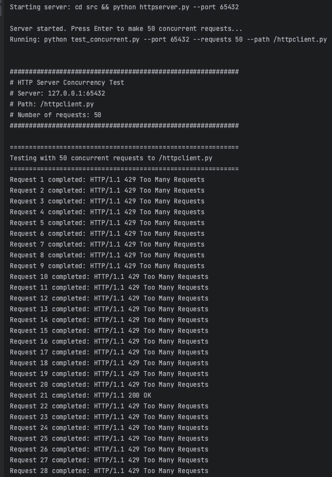
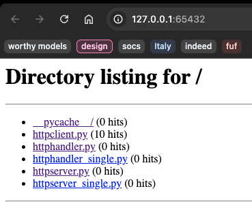
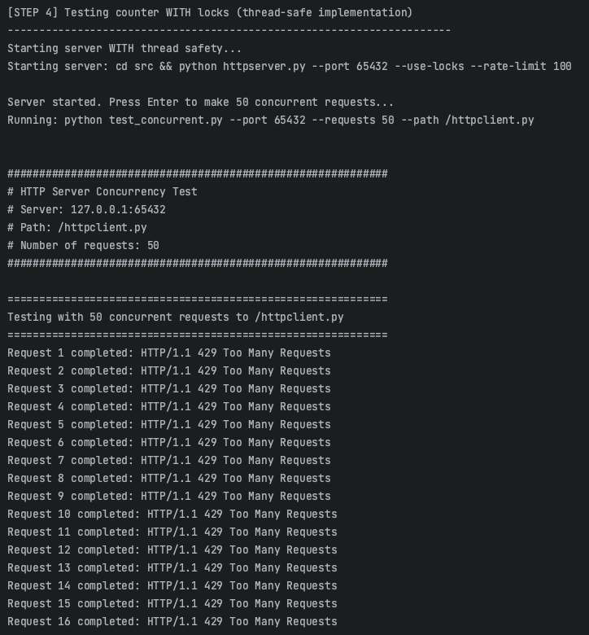
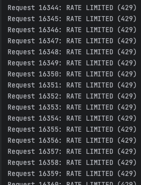

# Lab 2: Concurrent HTTP server
## The Task
In this lab, you will make your HTTP server multithreaded, so that it can handle multiple connections concurrently. You can either create a thread per request, or use a thread pool.
To test it, write a script that makes multiple concurrent requests to your server. Add a delay to the request handler to simulate work (~1s), make 10 concurrent requests and measure the amount of time in which they are handled. Do the same with the single-threaded server from the previous lab. Compare the two.

## Implementation Showcase

This is the general workflow of the demo that showcases the main tasks for the lab

Now we're showing the concurrency of a single-threaded server

Now with a multi-threaded server, the responses are much faster

To show race condition, we send 50 concurrent requests and we will see that the number of clicks is 
inconsistent.

Instead of getting 50 clicks for each requests, the number of clicks is recorded as 10

Now we run with thread locks to ensure that the race condition is gone

As we can see, the number of hits is exactly 50 for each request that was received by the server

To test rate-limiting, the script is spamming the server with requests for 10 seconds straight. From the 
screenshot it can be seen that the server stops processing the requests after hitting the rate limit and 
is returing 429 error.

This is how the 429 error looks like in the browser

